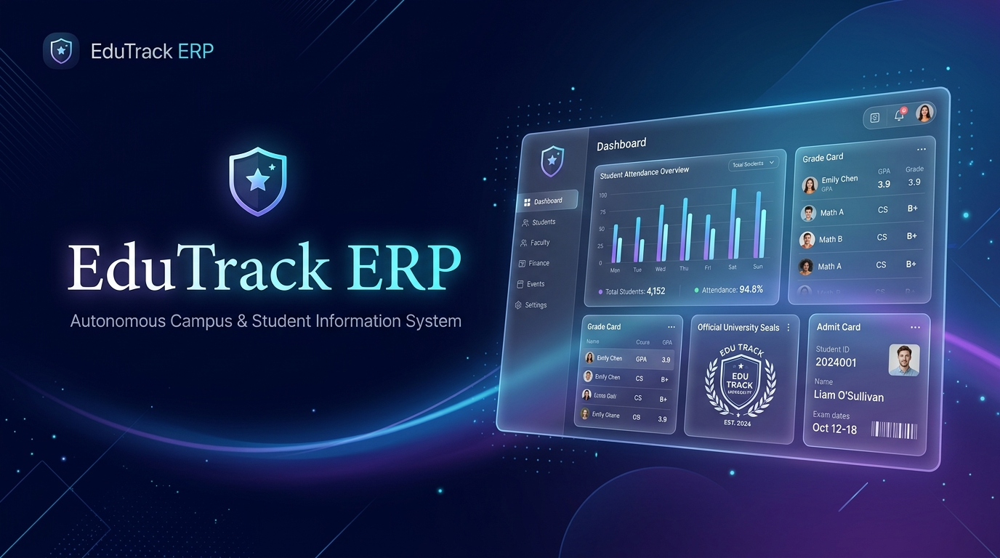
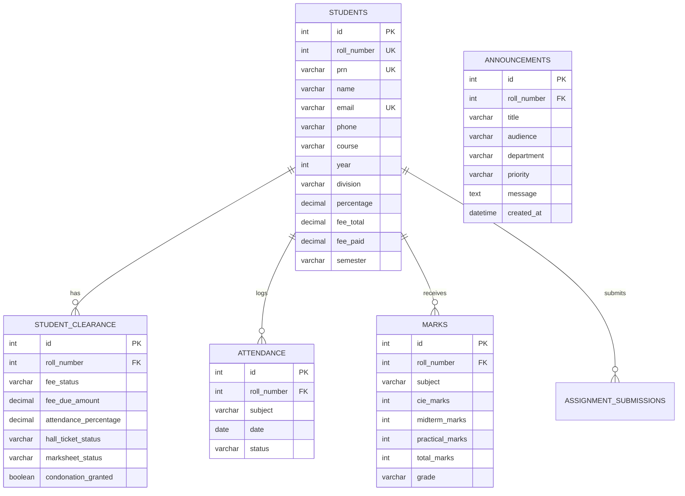

<div align="center">

  

  # 🎓 EduTrack ERP
  ### Autonomous Campus & Student Information System

  [](https://react.dev/)
  [](https://vitejs.dev/)
  [](https://nodejs.org/)
  [](https://expressjs.com/)
  [](https://www.mysql.com/)
  [](https://www.oracle.com/java/)
  [](https://developer.mozilla.org/en-US/docs/Web/API/WebSockets_API)
  [](LICENSE)

  <p align="center">
    <b>A modern, enterprise-grade Autonomous Higher-Education ERP & Student Information System.</b><br>
    Engineered with sub-millisecond MySQL 8.0 WebSocket data synchronization, Apple-grade frosted glassmorphic UI, multi-page comprehensive 360° academic dossiers, automated batch admit card printing, institutional Excel reporting, and 4-tier examination clearance governance.
  </p>

  <p align="center">
    <a href="#-key-features">Key Features</a> •
    <a href="#-theme--design-system">Theme & Design System</a> •
    <a href="#-system-architecture">System Architecture</a> •
    <a href="#-role-based-ecosystem">Role Consoles</a> •
    <a href="#-quickstart--installation">Quickstart</a> •
    <a href="#-database-schema">Database Schema</a> •
    <a href="#-api--websocket-reference">API Reference</a>
  </p>

</div>

---

## 🌟 Overview

**EduTrack ERP** bridges the gap between legacy university enterprise software and modern, frictionless user experience. Designed for autonomous institutes, colleges, and polytechnics, it delivers unified governance across three dedicated stakeholders: **Institutional Administrators**, **Department Faculty / Proctors**, and **Undergraduate Candidates**.

Unlike conventional university ERPs that require manual page refreshes and generate unstyled CSV dumps, EduTrack features:
- **Bi-Directional WebSocket Event Streaming**: Sub-second synchronization for grades, enrollment, and administrative circulars.
- **Institutional Excel Reporting Engine (`.xls`)**: Fully styled spreadsheets with institutional mastheads, KPI counters, and formatted status badges.
- **Pixel-Perfect A4 Multi-Page Print Engines**: Multi-page 360° student academic dossiers and automated batch hall ticket printing.
- **Enterprise-Grade Clearance Governance**: Automated 4-tier gating (Finance, Attendance, Labs, Library) before exam credentials unlock.

---

## ✨ Key Features

### 📑 1. Comprehensive Student 360° Academic Dossiers
Authentic multi-page university student records compiled across 6 modular sections:

<div align="center">
  
</div>

1. **Biographical Profile & Admission Identity**: Roll #, PRN, degree program, 3D avatar photo, barcode, and academic standing.
2. **Semester Academic Marks & Evaluation**: Calibrated CIE (30), Midterm (50), Practical (25), Total (%), Letter Grades, and Instructor records.
3. **Tuition & Accounts Ledger**: Total fee, paid amount, outstanding balance, and detailed transaction ledger with bank receipt numbers.
4. **Physical & Lab Attendance Compliance**: Conducted vs. attended classes, defaulter list tagging (<75%), and mandatory remedial classes counter.
5. **Coursework & Lab Deliverables Portfolio**: Submissions timestamps, file archives, scores, and faculty feedback notes.
6. **4-Tier Clearance & Seal**: Accounts, Laboratory, Central Library, and Gatekeeper Hall Ticket Authorization with signatures for Student, Class Teacher, HOD, and Registrar.
* **Zero-Clipping Multi-Page Flow**: Configured with `@page { size: A4 portrait }` and `page-break-inside: avoid` to seamlessly flow across multiple pages without slicing tables or signature rows.

---

### 🖨️ 2. Automated Batch Hall Ticket Print Engine
Faculty and administrators can print admit cards for the entire cohort in one operation:

<div align="center">
  
</div>

* **Strict Roll Number Ordering**: Candidates are automatically sorted ascending by Roll Number (`101, 102, 103, 104, 105...`).
* **1 Candidate per A4 Page**: Enforces `@media print { page-break-after: always; break-after: page; }` ensuring each student receives a dedicated, full-sheet admit card with candidate credentials, 7 registered examination sessions, instructions, and proctor signatures.
* **Autonomous Attendance Gatekeeper**: Withholds admit cards for students with attendance below 75% unless approved via a Dean's medical waiver.

---

### 📊 3. Institutional Excel Export & Official Print Registers
* **Formatted Spreadsheet Engine (`.xls`)**: Exports rosters directly into formatted Microsoft Excel / Google Sheets workbooks with institutional masthead, department/division header, executive KPI statistics (Average Attendance, Defaulters, Distinction), dark navy headers, cell borders, and status badges.
* **Official Print Registers**: Generates formal institutional student audit registers on A4 paper ready for physical signature and university archiving.

---

### ⚡ 4. Instant Real-Time Notice Broadcasting
* **Instant WebSocket Streaming**: When an Administrator or Faculty member broadcasts a circular, it is instantly pushed across all active browser sessions with sub-second latency.
* **Dynamic Student Notification Badge**: The student's notification bell increments its unread badge count immediately and triggers an instant Toast notification without requiring a page reload.
* **Real-time Alert Banners**: Student dashboards dynamically display high-priority circular alerts with single-click navigation.

---

### 🪪 5. Virtual Smart Passes & RFID Identity Cards
* **Digital Identity Cards**: Generates dual-sided physical ID passes with university crest, student photo, unique PRN, program code, blood group, barcode, and security holograms.
* **Multi-Theme Pass Switcher**: Instant switching between **Emerald Green**, **Sapphire Blue**, and **Obsidian Honor** styling palettes with flip animation and single-click direct print/download.

---

## 🎨 Theme & Design System

EduTrack ERP is built with a bespoke Apple-inspired design system adhering to strict typography, color harmony, and micro-interactions:

| Token / Layer | Implementation | Visual Effect |
| :--- | :--- | :--- |
| **Glassmorphism** | `backdrop-filter: blur(20px); rgba(255, 255, 255, 0.75)` | Modern frosted-glass aesthetic with deep surface layering |
| **Color Spectrum** | Deep Indigo (`#4338ca`), Emerald (`#10b981`), Sapphire (`#2563eb`), Amber (`#f59e0b`) | Curated semantic palettes for states, clearances, and grades |
| **Typography** | Inter, SF Pro Display, system font stack | Ultra-crisp numerical tabular alignment and proportional headings |
| **Motion Physics** | Framer Motion (staggered cards, spring transitions) | Tactile responsive feedback on all tabs, modals, and buttons |
| **Print Styling** | Dedicated `@media print` stylesheets with A4 page constraints | Guarantees zero cutoffs on margins, headers, and signature lines |

### Smart Pass Themes

```text
  ┌──────────────────────┐  ┌──────────────────────┐  ┌──────────────────────┐
  │   🌲 Emerald Theme   │  │   💎 Sapphire Theme  │  │   🌑 Obsidian Theme  │
  │  Primary: #065f46    │  │  Primary: #1e3a8a    │  │  Primary: #0f172a    │
  │  Accent:  #10b981    │  │  Accent:  #3b82f6    │  │  Accent:  #64748b    │
  │  Badge:   #ecfdf5    │  │  Badge:   #eff6ff    │  │  Badge:   #f1f5f9    │
  └──────────────────────┘  └──────────────────────┘  └──────────────────────┘
```

---

## 🏗️ System Architecture

```text
                                  ┌───────────────────────────────────────────────┐
                                  │      EduTrack React + Vite Frontend App       │
                                  │   (Apple-Grade UI · TailwindCSS/Vanilla CSS)  │
                                  └───────▲───────────────────────────────▲───────┘
                                          │ HTTP REST API                 │
                                          │ (Port 5000/api)               │ WebSocket Engine
                                          │                               │ (ws://localhost:5000)
                                          ▼                               ▼
                                  ┌───────────────────────────────────────────────┐
                                  │           Node.js & Express Server            │
                                  │  - Realtime Event Broadcaster (wss)           │
                                  │  - REST Controllers (Students, Clearances)   │
                                  │  - System Health & Diagnostics Engine         │
                                  └───────────────────────┬───────────────────────┘
                                                          │ Connection Pool
                                                          │ (mysql2/promise)
                                                          ▼
                                  ┌───────────────────────────────────────────────┐
                                  │            MySQL 8.0 Database Engine          │
                                  │           [student_management]                │
                                  │   - students          - attendance            │
                                  │   - student_clearance - marks                 │
                                  │   - teachers          - timetable             │
                                  └───────────────────────▲───────────────────────┘
                                                          │ JDBC Driver (Port 3306)
                                                          │
                                  ┌───────────────────────┴───────────────────────┐
                                  │      Standalone Core Java Console App         │
                                  │   (DAO Pattern · OOP Business Service · CLI)  │
                                  └───────────────────────────────────────────────┘
```

---

## 👥 Role-Based Ecosystem

| Role | Primary Purpose | Key Features Available |
| :--- | :--- | :--- |
| **Institutional Admin** | Campus-Wide Operations & Institutional Audit | • Department Intake Quotas & Student Enrollment<br>• Official Students Directory with Excel & Print Export<br>• Batch Dossier Generation for Entire Cohorts<br>• PRN Unique Identifier Generator<br>• System Diagnostics, MySQL Status & Audit Trails |
| **Faculty / Teacher** | Academic Instruction & Examination Proctoring | • Departmental & Division Student Rosters with Filters<br>• Subject-Wise Continuous Internal Evaluation (CIE) Marks<br>• Coursework & Assignment Submission Grading with Feedback<br>• **Batch Hall Ticket Print Engine** (1 per page by Roll #)<br>• Attendance Defaulter List & Makeup Calculator |
| **Student Candidate** | Self-Service Learning & Credentials Portal | • 360° Academic Dashboard with Real-Time Attendance Gauge<br>• Instant Real-Time Circular Alerts & Push Notifications<br>• Combined Examination Admit Card (Hall Ticket) Download<br>• CBCS Grade Card & Official Transcript Preview<br>• Coursework Submissions Portal with File Uploads |

---

## 📁 Repository Structure

```text
StudentManagement/
├── backend/                                   # Standalone Core Java Console Application
│   ├── lib/
│   │   └── mysql-connector-j-8.4.0.jar        # Official MySQL JDBC Driver
│   └── src/com/krrish/studentmanagement/
│       ├── Main.java                          # CLI entry point, interactive menu loop
│       ├── model/                             # Data models (Student, Assignment, Attendance)
│       ├── dao/                               # JDBC Data Access Objects (CRUD SQL operations)
│       ├── service/                           # Business logic & validation layer
│       ├── comparator/                        # 6 Sorting comparators (Roll, Name, Percentage)
│       └── util/                              # DBConnection & DBInitializer
│
├── server/                                    # Express & WebSocket Real-Time API Server
│   ├── server.js                              # REST endpoints, WebSocket broadcaster, MySQL pool
│   ├── init_db.js                             # Database schema initializer & mock seeder
│   └── package.json                           # Server dependencies (express, ws, mysql2, cors)
│
├── frontend/                                  # React 18/19 + Vite Web Application
│   ├── public/assets/                         # Institutional banners, emblems, student avatars
│   ├── src/
│   │   ├── components/
│   │   │   ├── admin/                         # Admin PRN Generator, Approvals, Allocation
│   │   │   ├── common/                        # Announcements, Timetable, Virtual ID Card, Clearance
│   │   │   ├── teacher/                       # Marks & Evaluation, Grading, Role Hub
│   │   │   └── Header.jsx & Sidebar.jsx       # Global responsive navigation with Role Switcher
│   │   ├── pages/
│   │   │   ├── AdminPanel.jsx                 # Comprehensive Institutional Administrator Console
│   │   │   ├── TeacherPanel.jsx               # Faculty Roster, Grading & Batch Hall Tickets Hub
│   │   │   ├── StudentPanel.jsx               # Candidate Academic Dashboard & Realtime Circulars
│   │   │   ├── StudentDetails.jsx             # 360° Student Dossier Modal
│   │   │   └── DocumentationView.jsx          # Interactive Project Documentation & Slides Deck
│   │   ├── lib/
│   │   │   ├── exportFormatHelper.js          # Excel (.xls), Print Roster, Batch Hall Tickets & Dossiers
│   │   │   ├── studentProfiles.js             # Student personas, avatars, bio catalog
│   │   │   └── clearanceData.js               # 4-Tier examination gatekeeper logic
│   │   ├── services/
│   │   │   └── studentService.js              # REST & WebSocket client with offline cache
│   │   └── index.css                          # Apple-grade design system & print styles
│   ├── package.json
│   └── vite.config.js
│
├── docs/                                      # Project documentation & graphical assets
│   └── assets/                                # Badges, banners, and feature mockups
├── database/
│   └── student_management.sql                 # Production SQL schema & initial seed data
├── run_backend.bat                            # 1-Click execution script for Java CLI
├── DESIGN.md                                  # Architectural design specifications
└── README.md                                  # Comprehensive documentation
```

---

## 🚀 Quickstart & Installation

### Prerequisites
- **Node.js**: v18.0.0 or higher
- **MySQL Server**: 8.0 or higher (Port 3306)
- **Java Development Kit (JDK)**: Java 17 or higher (for standalone console engine)

---

### Step 1: Clone the Repository
```bash
git clone https://github.com/shrikrishna-lab/StudentManagement.git
cd StudentManagement
```

---

### Step 2: Database Setup
1. Create the MySQL database:
   ```sql
   CREATE DATABASE student_management;
   ```
2. Import the schema and seed data using MySQL CLI or Workbench:
   ```bash
   mysql -u root -p student_management < database/student_management.sql
   ```

---

### Step 3: Configure and Start the Node Backend
```bash
cd server
npm install
```

Configure your database credentials in `server.js` or via environment variables:
```javascript
const pool = mysql.createPool({
  host: process.env.DB_HOST || 'localhost',
  port: process.env.DB_PORT || 3306,
  user: process.env.DB_USER || 'root',
  password: process.env.DB_PASSWORD || 'your_password',
  database: process.env.DB_NAME || 'student_management'
});
```

Start the server:
```bash
npm start
```
> Server will launch on `http://localhost:5000` with WebSocket synchronization on `ws://localhost:5000`.

---

### Step 4: Start the Frontend Application
In a separate terminal:
```bash
cd ../frontend
npm install
npm run dev
```
> Open your browser and navigate to: `http://localhost:5173/`

---

### Step 5: (Optional) Run the Java Console Engine
Double-click `run_backend.bat` or run:
```powershell
.\run_backend.bat
```

---

## 🗄️ Database Schema



---

## 📡 API & WebSocket Reference

### HTTP REST Endpoints

| Method | Endpoint | Description |
| :--- | :--- | :--- |
| `GET` | `/api/health` | Live MySQL connection ping, latency, and active WebSocket client count |
| `GET` | `/api/students` | Retrieves all students with optional search, course, and division filters |
| `POST` | `/api/students` | Enrolls a new student with auto-generated PRN and clearance row |
| `PUT` | `/api/students/:roll` | Updates student profile, percentage, and fee attributes |
| `DELETE` | `/api/students/:roll` | Removes student record and cascade-deletes related clearances |
| `POST` | `/api/announcements/broadcast` | Broadcasts an official circular to all connected students in real time |
| `GET` | `/api/analytics/overview` | Computes live class averages, highest percentage, and cohort totals |

### WebSocket Real-Time Events (`ws://localhost:5000`)

| Event Type | Payload | Action Triggered on Client |
| :--- | :--- | :--- |
| `ANNOUNCEMENT_BROADCAST` | `{ id, title, message, priority, audience }` | Increments notification badge, pops Toast alert, inserts circular |
| `STUDENT_ADDED` | `{ rollNumber, name, course, percentage }` | Prepends new student to all active admin/teacher rosters |
| `STUDENT_UPDATED` | `{ rollNumber, ...attributes }` | Optimistically updates candidate profile across open views |
| `STUDENT_DELETED` | `{ rollNumber }` | Removes student card from table in real time |
| `CLEARANCE_UPDATED` | `{ rollNumber, hallTicketStatus }` | Instantly unlocks or locks hall ticket & grade transcripts |

---

## 🛠️ Tech Stack Matrix

- **Frontend**: React 18/19, Vite 6, Motion (Framer Motion), Lucide Icons
- **Styling**: Vanilla CSS Design Tokens, Apple-inspired frosted glassmorphism, responsive flex/grid layouts
- **Backend API**: Node.js, Express.js, `ws` (WebSocket Server), `mysql2/promise` (Connection Pooling)
- **Database**: MySQL 8.0 Enterprise Relational Engine
- **Console Core**: Java 21 LTS, JDBC PreparedStatement, DAO Design Pattern
- **Document & Export Utilities**: XML/HTML Spreadsheet (`.xls`), HTML5 Canvas, Window Print Multi-Page Engines

---

## 🛡️ License

Distributed under the **MIT License**. See `LICENSE` for more information.

---

<div align="center">
  <sub>Engineered with ❤️ by <a href="https://github.com/shrikrishna-lab">Shrikrishna Handibag</a></sub>
</div>
